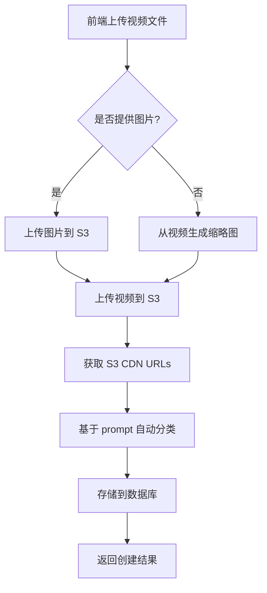

# Discover 管理系统技术设计文档

**创建日期**: 2025-10-31
**状态**: 待审核
**版本**: v1.0

---

## 一、项目背景与目标

### 1.1 当前问题
- Discover 数据硬编码在 `/data/video-templates.ts` 中（93 条数据，555 行代码）
- 无法动态管理内容，每次更新需要修改代码并重新部署
- 存在两套未整合的 Discover 系统（template-gallery 和 video-prompt-discovery）

### 1.2 目标
- ✅ 将 Discover 数据迁移到数据库（Supabase/PostgreSQL）
- ✅ 在 Admin 后台新增 Discover 管理模块
- ✅ 支持视频上传到 S3（`static.vidfab.ai/discover-new/`）
- ✅ 支持从视频自动生成缩略图（当 image_url 为空时）
- ✅ 保留自动分类逻辑
- ✅ 前端 `/create` 页面改为从 API 读取数据
- ✅ 清理未使用的代码（video-prompt-discovery.tsx）

---

## 二、数据库设计

### 2.1 表结构：`discover_videos`

```sql
CREATE TABLE IF NOT EXISTS discover_videos (
  -- 主键
  id UUID PRIMARY KEY DEFAULT uuid_generate_v4(),

  -- 核心内容
  prompt TEXT NOT NULL,
  video_url TEXT NOT NULL,
  image_url TEXT,  -- 可选，用作缩略图/poster

  -- 分类和排序
  category VARCHAR(50) DEFAULT 'abstract',
  display_order INTEGER DEFAULT 0,

  -- 状态管理
  status VARCHAR(20) DEFAULT 'active' CHECK (status IN ('active', 'inactive', 'draft')),
  is_featured BOOLEAN DEFAULT false,

  -- 审计字段
  created_by UUID REFERENCES users(uuid) ON DELETE SET NULL,
  created_at TIMESTAMP WITH TIME ZONE DEFAULT NOW(),
  updated_at TIMESTAMP WITH TIME ZONE DEFAULT NOW(),

  -- 索引
  CONSTRAINT valid_category CHECK (category IN (
    'portrait', 'nature', 'fantasy', 'lifestyle',
    'abstract', 'cinematic', 'technology', 'vehicles'
  ))
);

-- 索引
CREATE INDEX idx_discover_videos_category ON discover_videos(category);
CREATE INDEX idx_discover_videos_status ON discover_videos(status);
CREATE INDEX idx_discover_videos_display_order ON discover_videos(display_order DESC);
CREATE INDEX idx_discover_videos_created_at ON discover_videos(created_at DESC);

-- 更新时间自动更新触发器
CREATE OR REPLACE FUNCTION update_discover_videos_updated_at()
RETURNS TRIGGER AS $$
BEGIN
  NEW.updated_at = NOW();
  RETURN NEW;
END;
$$ LANGUAGE plpgsql;

CREATE TRIGGER trigger_discover_videos_updated_at
  BEFORE UPDATE ON discover_videos
  FOR EACH ROW
  EXECUTE FUNCTION update_discover_videos_updated_at();
```

### 2.2 字段说明

| 字段 | 类型 | 必填 | 说明 |
|------|------|------|------|
| id | UUID | ✅ | 主键，自动生成 |
| prompt | TEXT | ✅ | 视频描述/提示词 |
| video_url | TEXT | ✅ | 视频 CDN URL（S3） |
| image_url | TEXT | ❌ | 缩略图 URL，为空时自动从视频生成 |
| category | VARCHAR | ✅ | 分类（自动分类生成） |
| display_order | INTEGER | ✅ | 排序权重，数字越大越靠前 |
| status | VARCHAR | ✅ | 状态：active/inactive/draft |
| is_featured | BOOLEAN | ✅ | 是否精选展示 |
| created_by | UUID | ❌ | 创建者（管理员）UUID |
| created_at | TIMESTAMP | ✅ | 创建时间 |
| updated_at | TIMESTAMP | ✅ | 更新时间（自动触发器） |

### 2.3 分类枚举值

```typescript
enum DiscoverCategory {
  PORTRAIT = 'portrait',      // 肖像
  NATURE = 'nature',          // 自然
  FANTASY = 'fantasy',        // 奇幻
  LIFESTYLE = 'lifestyle',    // 生活
  ABSTRACT = 'abstract',      // 抽象
  CINEMATIC = 'cinematic',    // 电影
  TECHNOLOGY = 'technology',  // 科技
  VEHICLES = 'vehicles'       // 交通工具
}
```

---

## 三、API 设计

### 3.1 Admin API（需要管理员权限）

**基础路径**: `/api/admin/discover`

#### 📋 获取列表（带分页和筛选）
```
GET /api/admin/discover

Query参数：
- page: number (默认 1)
- limit: number (默认 50, 最大 100)
- category: string (可选，筛选分类)
- status: 'active' | 'inactive' | 'draft' | 'all' (默认 'all')
- search: string (可选，搜索 prompt)
- sortBy: 'created_at' | 'display_order' | 'updated_at' (默认 'display_order')
- sortOrder: 'asc' | 'desc' (默认 'desc')

响应：
{
  success: true,
  data: DiscoverVideo[],
  pagination: {
    total: number,
    page: number,
    limit: number,
    totalPages: number
  }
}
```

#### 🔍 获取单条
```
GET /api/admin/discover/[id]

响应：
{
  success: true,
  data: DiscoverVideo
}
```

#### ➕ 创建新数据
```
POST /api/admin/discover

Body (multipart/form-data):
{
  prompt: string (必填),
  videoFile?: File (可选，与 videoUrl 二选一),
  videoUrl?: string (可选，与 videoFile 二选一),
  imageFile?: File (可选，与 imageUrl 二选一),
  imageUrl?: string (可选，与 imageFile 二选一),
  category?: string (可选，不填则自动分类),
  status?: 'active' | 'inactive' | 'draft' (默认 'draft'),
  is_featured?: boolean (默认 false),
  display_order?: number (默认 0)
}

响应：
{
  success: true,
  data: DiscoverVideo,
  message: "创建成功"
}
```

#### ✏️ 更新数据
```
PUT /api/admin/discover/[id]

Body: 同创建接口

响应：
{
  success: true,
  data: DiscoverVideo,
  message: "更新成功"
}
```

#### 🗑️ 删除数据
```
DELETE /api/admin/discover/[id]

响应：
{
  success: true,
  message: "删除成功"
}
```

#### 📤 批量操作
```
POST /api/admin/discover/batch

Body:
{
  action: 'delete' | 'updateStatus' | 'updateOrder',
  ids: string[],
  payload?: {
    status?: 'active' | 'inactive' | 'draft',
    display_order?: number
  }
}

响应：
{
  success: true,
  message: "批量操作成功",
  affected: number
}
```

#### 📊 获取统计信息
```
GET /api/admin/discover/stats

响应：
{
  success: true,
  data: {
    total: number,
    byCategory: { [key: string]: number },
    byStatus: { active: number, inactive: number, draft: number },
    featured: number
  }
}
```

### 3.2 公开 API（无需权限，仅读取）

#### 📋 前台获取 Discover 列表
```
GET /api/discover

Query参数：
- category: string (可选，筛选分类，'all' 表示全部)
- limit: number (默认 50)

响应：
{
  success: true,
  data: DiscoverVideo[] (仅返回 status = 'active' 的数据)
}
```

#### 📊 获取分类统计
```
GET /api/discover/categories

响应：
{
  success: true,
  data: [
    { name: "All", key: "all", count: 93 },
    { name: "Portrait", key: "portrait", count: 15 },
    { name: "Nature", key: "nature", count: 12 },
    ...
  ]
}
```

---

## 四、文件上传与存储

### 4.1 S3 存储路径规范

**Bucket**: `static.vidfab.ai`
**目录结构**:
```
discover-new/
├── videos/
│   └── discover-video-{uuid}-{timestamp}.mp4
└── images/
    └── discover-image-{uuid}-{timestamp}.{ext}
```

### 4.2 文件命名规则

```typescript
// 视频文件
const videoFileName = `discover-video-${crypto.randomUUID()}-${Date.now()}.mp4`;

// 图片文件
const imageFileName = `discover-image-${crypto.randomUUID()}-${Date.now()}.${ext}`;
```

### 4.3 上传流程



### 4.4 视频缩略图生成（当 image_url 为空时）

**方案**：使用 `ffmpeg` 提取视频第 1 秒的帧作为缩略图

```typescript
// 伪代码
async function generateThumbnailFromVideo(videoFile: File): Promise<Buffer> {
  // 1. 使用 ffmpeg 提取帧
  const command = `ffmpeg -i ${videoFile} -ss 00:00:01 -vframes 1 -q:v 2 output.jpg`;

  // 2. 压缩优化
  // 3. 返回 Buffer

  return thumbnailBuffer;
}
```

**技术选型**：
- 使用 `fluent-ffmpeg` npm 包
- 或使用云服务（如 AWS Lambda + ffmpeg layer）
- 或使用第三方服务（如 Cloudinary）

**实施建议**：先使用简单方案（手动上传图片），后续迭代时再实现自动生成。

---

## 五、自动分类逻辑

### 5.1 复用现有分类器

位置：`/utils/video-prompt-classifier.ts`（如已存在）或 `/data/video-templates.ts` 中的 `categorizePrompt` 函数

```typescript
// 复用现有逻辑
const categoryKeywords = {
  portrait: ['woman', 'girl', 'boy', 'man', 'person', 'face', 'eyes', 'hair', 'smile', '女子', '美女', '男子'],
  nature: ['butterfly', 'flowers', 'tree', 'water', 'ocean', 'mountain', 'sky', 'sunlight', 'butterfly', 'panda', 'cat', 'dog', '猫', '狮子'],
  fantasy: ['fairy', 'mermaid', 'dragon', 'magic', 'mystical', 'werewolf', 'space', 'astronaut', 'floating', 'glowing'],
  lifestyle: ['kitchen', 'home', 'office', 'laundry', 'cooking', 'coffee', 'beer', 'sofa', '锅', '土豆丝'],
  abstract: ['animate', 'move', 'particles', 'transform', 'gears', 'abstract', 'minimal', 'texture'],
  cinematic: ['camera', 'zoom', 'tracking', 'cinematic', 'film', 'professional', 'lighting', 'composition'],
  vehicles: ['car', 'motorcycle', 'spaceship', 'satellite', 'bicycle', 'train'],
  technology: ['cyberpunk', 'futuristic', 'sci-fi', 'robot', 'AI', 'digital', 'gaming', 'tech']
};

function categorizePrompt(prompt: string): string {
  const lowerPrompt = prompt.toLowerCase();
  const scores: { [key: string]: number } = {};

  Object.entries(categoryKeywords).forEach(([category, keywords]) => {
    scores[category] = keywords.filter(keyword =>
      lowerPrompt.includes(keyword.toLowerCase())
    ).length;
  });

  const bestCategory = Object.entries(scores).reduce((a, b) =>
    scores[a[0]] > scores[b[0]] ? a : b
  )[0];

  return scores[bestCategory] > 0 ? bestCategory : 'abstract';
}
```

### 5.2 API 中应用

```typescript
// POST /api/admin/discover
export async function POST(request: Request) {
  // ...解析表单数据

  // 如果没有手动指定分类，则自动分类
  const category = formData.category || categorizePrompt(formData.prompt);

  // 存储到数据库
  const result = await supabaseAdmin
    .from('discover_videos')
    .insert({
      prompt: formData.prompt,
      video_url: videoUrl,
      image_url: imageUrl,
      category: category,
      // ...其他字段
    });
}
```

---

## 六、Admin 后台界面设计

### 6.1 路由结构

```
/admin/discover/
├── page.tsx           # 列表页（主页面）
├── new/
│   └── page.tsx      # 新增页面
└── [id]/
    └── edit/
        └── page.tsx  # 编辑页面
```

### 6.2 组件结构

```
/components/admin/discover/
├── discover-list.tsx              # 列表主组件
├── discover-table.tsx             # 表格组件
├── discover-filters.tsx           # 筛选组件
├── discover-form.tsx              # 表单组件（新增/编辑复用）
├── discover-video-preview.tsx     # 视频预览组件
├── discover-upload-dialog.tsx     # 上传对话框
└── discover-stats-card.tsx        # 统计卡片组件
```

### 6.3 界面功能清单

#### 列表页 (`/admin/discover`)
- ✅ 表格展示（缩略图、prompt、分类、状态、创建时间、操作）
- ✅ 筛选：按分类、状态筛选
- ✅ 搜索：搜索 prompt 关键词
- ✅ 排序：按创建时间、display_order 排序
- ✅ 批量操作：批量删除、批量修改状态
- ✅ 快速操作：编辑、删除、预览、复制 URL
- ✅ 统计卡片：总数、各分类数量、状态分布

#### 新增/编辑页面
- ✅ 表单字段：
  - Prompt 输入（Textarea，必填）
  - 视频上传方式选择：
    - 本地文件上传（File Input）
    - URL 输入（Text Input）
  - 图片上传方式选择（可选）：
    - 本地文件上传
    - URL 输入
    - 不上传（自动从视频生成）
  - 分类选择（Select，可选，不选则自动分类）
  - 状态选择（Radio: Active / Inactive / Draft）
  - 是否精选（Checkbox）
  - 排序权重（Number Input）
- ✅ 实时预览：上传后实时预览视频和缩略图
- ✅ 表单验证：必填项验证、URL 格式验证、文件大小限制
- ✅ 提交反馈：Loading 状态、成功/失败提示

### 6.4 UI 参考设计

**技术栈**：
- Radix UI（已有）
- Tailwind CSS（已有）
- React Hook Form（表单管理）
- SWR（数据获取和缓存）

**设计风格**：参考现有 Admin 页面风格（`/admin/users`、`/admin/tasks`）

---

## 七、前端 /create 页面改造

### 7.1 改造文件

**主要文件**：`/components/create/template-gallery.tsx`

**改造前**：
```typescript
import { videoTemplatesData } from '@/data/video-templates'

export function TemplateGallery() {
  const [videos, setVideos] = useState(videoTemplatesData);
  // ...
}
```

**改造后**：
```typescript
import useSWR from 'swr'

const fetcher = (url: string) => fetch(url).then(r => r.json())

export function TemplateGallery() {
  const { data, error, isLoading } = useSWR('/api/discover', fetcher);

  if (isLoading) return <LoadingSpinner />;
  if (error) return <ErrorMessage />;

  const videos = data?.data || [];

  // ...原有逻辑
}
```

### 7.2 数据格式兼容

确保 API 返回的数据格式与原 `videoTemplatesData` 兼容：

```typescript
// 原格式
interface VideoData {
  id: string;
  title: string;
  description: string;
  prompt: string;
  duration: number;
  aspectRatio: string;
  category: string;
  user: { id: string; name: string; avatar: string };
  createdAt: Date;
  urls: {
    thumbnail: { webp: string; jpg: string; placeholder: string };
    video: { low: string; medium: string; high: string; preview: string };
    poster: string;
  };
  metadata: { ... };
  loadState: string;
  quality: string;
  preloadStrategy: string;
}

// API 返回需要转换
function transformDiscoverVideoToVideoData(dbVideo: DiscoverVideo): VideoData {
  return {
    id: dbVideo.id,
    title: dbVideo.prompt.slice(0, 50) + (dbVideo.prompt.length > 50 ? '...' : ''),
    description: dbVideo.prompt,
    prompt: dbVideo.prompt,
    duration: 10, // 默认值
    aspectRatio: '16:9', // 默认值
    category: dbVideo.category,
    user: {
      id: 'system',
      name: 'VidFab',
      avatar: '/placeholder-user.jpg'
    },
    createdAt: new Date(dbVideo.created_at),
    urls: {
      thumbnail: {
        webp: dbVideo.image_url || dbVideo.video_url, // 临时方案
        jpg: dbVideo.image_url || dbVideo.video_url,
        placeholder: dbVideo.image_url || dbVideo.video_url
      },
      video: {
        low: dbVideo.video_url,
        medium: dbVideo.video_url,
        high: dbVideo.video_url,
        preview: dbVideo.video_url
      },
      poster: dbVideo.image_url || dbVideo.video_url
    },
    // ...其他字段使用默认值
  };
}
```

---

## 八、数据迁移策略

### 8.1 迁移脚本

创建文件：`/lib/database/migrate-discover-videos.sql`

```sql
-- 数据迁移脚本
-- 将 video-templates.ts 中的 93 条硬编码数据导入数据库

INSERT INTO discover_videos (prompt, video_url, image_url, category, status, display_order, created_at)
VALUES
  (
    'animate the image',
    'https://static.vidfab.ai/user-video/vidfab-2910ad47-9d15-4ab4-8a59-aea9cf2500d8.mp4',
    'https://static.vidfab.ai/user-image/vidfab-2910ad47-9d15-4ab4-8a59-aea9cf2500d8.png',
    'abstract',
    'active',
    100,
    NOW() - INTERVAL '100 days'
  ),
  (
    'A blonde woman stands in dim water, surrounded by multiple floating red roses...',
    'https://static.vidfab.ai/user-video/vidfab-cc5fedd1-507a-4415-bef7-7bfe1d3e8c49.mp4',
    'https://static.vidfab.ai/user-image/vidfab-cc5fedd1-507a-4415-bef7-7bfe1d3e8c49.png',
    'portrait',
    'active',
    99,
    NOW() - INTERVAL '99 days'
  )
  -- ... 其余 91 条数据
;
```

### 8.2 迁移流程

1. **准备阶段**：
   - 创建数据库表 `discover_videos`
   - 测试表结构和约束

2. **数据导出**：
   - 编写脚本从 `video-templates.ts` 提取数据
   - 生成 SQL INSERT 语句
   - 自动分类每条数据

3. **迁移执行**：
   - 在测试环境执行迁移
   - 验证数据完整性和分类准确性
   - 在生产环境执行迁移

4. **验证阶段**：
   - 对比新旧数据数量
   - 验证前端 `/create` 页面显示正常
   - 测试 API 响应速度

### 8.3 迁移辅助脚本（Node.js）

创建文件：`/scripts/migrate-discover-data.ts`

```typescript
import fs from 'fs';
import { videoTemplatesData } from '@/data/video-templates';

function generateMigrationSQL() {
  const values = videoTemplatesData.map((video, index) => {
    const prompt = video.prompt.replace(/'/g, "''"); // 转义单引号
    const videoUrl = video.urls.video.high;
    const imageUrl = video.urls.poster;
    const category = video.category;
    const displayOrder = 1000 - index; // 倒序排列

    return `  (
    '${prompt}',
    '${videoUrl}',
    '${imageUrl}',
    '${category}',
    'active',
    ${displayOrder},
    NOW() - INTERVAL '${index} days'
  )`;
  }).join(',\n');

  const sql = `
-- 自动生成的数据迁移脚本
-- 生成时间: ${new Date().toISOString()}
-- 数据条数: ${videoTemplatesData.length}

INSERT INTO discover_videos (prompt, video_url, image_url, category, status, display_order, created_at)
VALUES
${values}
;
`;

  fs.writeFileSync('./lib/database/migrate-discover-videos.sql', sql);
  console.log(`✅ 迁移脚本已生成：${videoTemplatesData.length} 条数据`);
}

generateMigrationSQL();
```

---

## 九、代码清理方案

### 9.1 需要清理的文件

| 文件 | 操作 | 理由 |
|------|------|------|
| `/data/video-templates.ts` | 保留但重命名为 `video-templates.backup.ts` | 备份旧数据，迁移后可删除 |
| `/data/demo-video-templates.ts` | 删除 | 不再使用 |
| `/components/video-prompt-discovery.tsx` | 删除 | 未使用的 Discover 系统 |
| `/utils/video-prompt-demo.ts` | 保留但提取 `categorizePrompt` | 复用分类逻辑 |
| `/utils/video-prompt-classifier.ts` | 保留 | 自动分类核心逻辑 |

### 9.2 清理步骤

```bash
# 1. 重命名旧数据文件（备份）
mv data/video-templates.ts data/video-templates.backup.ts

# 2. 删除未使用文件
rm data/demo-video-templates.ts
rm components/video-prompt-discovery.tsx

# 3. 提取分类逻辑到独立文件
# 创建 /lib/discover/categorize.ts（复用逻辑）

# 4. 更新引用
# 全局搜索并替换引用路径
```

### 9.3 清理验证

- ✅ 项目能正常编译（`npm run build`）
- ✅ 没有 TypeScript 错误
- ✅ 没有未使用的 import
- ✅ 前端页面显示正常

---

## 十、实施计划与里程碑

### 阶段 1：数据库与 API（第 1-2 天）
- [ ] 创建数据库表和索引
- [ ] 编写数据迁移脚本
- [ ] 实现 Admin API（CRUD + 批量操作）
- [ ] 实现公开 API（只读）
- [ ] 编写 API 单元测试

### 阶段 2：文件上传与分类（第 3 天）
- [ ] 实现 S3 文件上传逻辑
- [ ] 实现自动分类功能
- [ ] （可选）实现视频缩略图生成

### 阶段 3：Admin 后台界面（第 4-5 天）
- [ ] 创建 Admin Discover 路由页面
- [ ] 实现列表页组件（表格、筛选、搜索）
- [ ] 实现新增/编辑表单组件
- [ ] 实现上传功能（本地文件 + URL）
- [ ] 实现批量操作功能
- [ ] 实现统计卡片

### 阶段 4：前端改造与集成（第 6 天）
- [ ] 改造 `/create` 页面（从 API 读取数据）
- [ ] 实现数据格式转换逻辑
- [ ] 测试前端显示和交互
- [ ] 优化加载性能（缓存、预加载）

### 阶段 5：数据迁移与清理（第 7 天）
- [ ] 执行数据迁移脚本
- [ ] 验证数据完整性
- [ ] 清理未使用代码
- [ ] 更新项目文档

### 阶段 6：测试与上线（第 8 天）
- [ ] 完整功能测试（CRUD、上传、分类）
- [ ] 性能测试（API 响应速度、并发）
- [ ] 权限测试（管理员 vs 普通用户）
- [ ] 生产环境部署

---

## 十一、技术风险与应对

| 风险 | 影响 | 应对措施 |
|------|------|---------|
| 视频缩略图生成失败 | 无缩略图展示 | 提供手动上传图片选项 |
| S3 上传失败 | 无法保存视频 | 错误重试机制 + 用户提示 |
| 数据迁移失败 | 旧数据丢失 | 先备份 + 分批迁移 + 回滚方案 |
| API 性能问题 | 页面加载慢 | 添加 Redis 缓存 + 分页限制 |
| 分类不准确 | 用户体验差 | 允许管理员手动修改分类 |

---

## 十二、性能优化建议

### 12.1 缓存策略

```typescript
// Redis 缓存示例
const CACHE_KEY = 'discover:videos:all';
const CACHE_TTL = 60 * 5; // 5 分钟

// GET /api/discover
export async function GET(request: Request) {
  // 1. 尝试从 Redis 获取
  const cached = await redis.get(CACHE_KEY);
  if (cached) {
    return Response.json(JSON.parse(cached));
  }

  // 2. 从数据库查询
  const data = await supabaseAdmin
    .from('discover_videos')
    .select('*')
    .eq('status', 'active')
    .order('display_order', { ascending: false });

  // 3. 写入 Redis
  await redis.setex(CACHE_KEY, CACHE_TTL, JSON.stringify(data));

  return Response.json(data);
}
```

### 12.2 CDN 优化

- ✅ S3 文件配置 CDN 加速
- ✅ 设置合理的 Cache-Control 头
- ✅ 视频使用自适应码率（HLS/DASH）

### 12.3 数据库优化

- ✅ 合理使用索引（已在表设计中添加）
- ✅ 分页查询避免全表扫描
- ✅ 使用 `LIMIT` 限制返回数量

---

## 十三、安全性考虑

### 13.1 权限验证

```typescript
// 所有 Admin API 必须验证管理员权限
import { requireAdmin } from '@/lib/admin/auth';

export async function POST(request: Request) {
  await requireAdmin(); // 抛出异常如果不是管理员

  // ...业务逻辑
}
```

### 13.2 文件上传安全

- ✅ 文件类型白名单验证（仅允许视频和图片）
- ✅ 文件大小限制（视频 < 500MB，图片 < 10MB）
- ✅ 文件名随机化（避免路径遍历攻击）
- ✅ 病毒扫描（可选，使用 ClamAV 或云服务）

### 13.3 SQL 注入防护

- ✅ 使用 Supabase ORM（自动参数化查询）
- ✅ 不直接拼接 SQL 字符串
- ✅ 输入验证和清洗

---

## 十四、监控与日志

### 14.1 关键指标

- API 响应时间（P50, P95, P99）
- 上传成功率
- 分类准确率（人工抽查）
- 缓存命中率

### 14.2 日志记录

```typescript
// 使用 Winston 或项目现有日志系统
logger.info('Discover video created', {
  id: video.id,
  category: video.category,
  createdBy: user.uuid,
  uploadDuration: Date.now() - startTime
});
```

---

## 十五、后续迭代计划

### Phase 2（未来功能）
- [ ] 视频编辑功能（裁剪、滤镜、水印）
- [ ] AI 生成 Prompt（根据视频内容）
- [ ] 用户反馈系统（点赞、收藏、举报）
- [ ] A/B 测试不同视频的转化率
- [ ] 多语言 Prompt 支持

### Phase 3（高级功能）
- [ ] 视频审核流程（待审核 → 已审核）
- [ ] 定时发布功能
- [ ] 视频分析面板（播放量、点击率）
- [ ] 与创作工具深度集成

---

## 十六、附录

### A. 数据字典

详见第二节"数据库设计"

### B. API 接口完整规范

详见第三节"API 设计"

### C. 依赖包清单

```json
{
  "dependencies": {
    "@supabase/supabase-js": "^2.47.10",
    "@aws-sdk/client-s3": "^3.x",
    "react-hook-form": "^7.x",
    "swr": "^2.x",
    "fluent-ffmpeg": "^2.x" // 如果实现缩略图生成
  },
  "devDependencies": {
    "@types/fluent-ffmpeg": "^2.x"
  }
}
```

### D. 环境变量

```bash
# S3 配置
AWS_ACCESS_KEY_ID=xxx
AWS_SECRET_ACCESS_KEY=xxx
AWS_REGION=us-west-1
S3_BUCKET_NAME=static.vidfab.ai

# Supabase
NEXT_PUBLIC_SUPABASE_URL=xxx
NEXT_PUBLIC_SUPABASE_ANON_KEY=xxx
SUPABASE_SERVICE_ROLE_KEY=xxx

# Redis（可选，用于缓存）
REDIS_URL=xxx
```

---

## 审核检查清单

在开始实施前，请确认：

- [ ] 数据库表设计已审核通过
- [ ] API 接口规范已确认
- [ ] Admin 界面功能清单已确认
- [ ] S3 存储路径已确认（`discover-new/`）
- [ ] 数据迁移策略已确认（保留旧数据）
- [ ] 自动分类逻辑已确认（复用现有）
- [ ] 视频缩略图生成策略已确认（手动上传优先，自动生成留待后续）
- [ ] 代码清理范围已确认
- [ ] 实施时间表已确认

---

**文档状态**: 🟡 待审核
**下一步**: 等待用户审核并确认后，进入实施阶段
