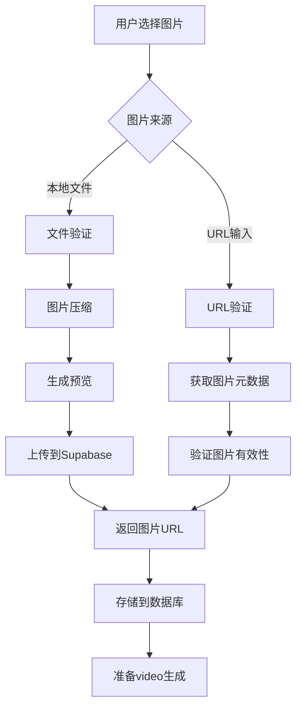

# 图片上传系统设计文档

## 系统概述

为VidFab AI视频平台设计的完整图片上传系统，专门用于image-to-video功能。支持本地文件上传和URL输入两种方式，包含图片处理、压缩、存储管理和性能优化等功能。

## 核心功能

### 1. 图片上传方式
- **本地文件上传**: 支持拖拽上传、点击选择文件
- **URL输入**: 直接输入图片URL，自动下载和验证
- **格式支持**: JPG, PNG, WebP
- **大小限制**: 10MB以内

### 2. 图片处理
- **自动压缩**: 根据质量预设自动优化图片
- **尺寸调整**: 智能调整分辨率，保持宽高比
- **格式转换**: 统一转换为最优格式
- **元数据提取**: 获取图片尺寸、大小等信息

### 3. 存储管理
- **Supabase Storage**: 安全的云存储
- **权限控制**: 用户只能访问自己的图片
- **路径规范**: 按用户ID组织文件结构
- **配额管理**: 监控用户存储使用情况

### 4. 性能优化
- **缓存系统**: 图片预览缓存管理
- **上传队列**: 并发控制和失败重试
- **预加载**: 智能预加载机制
- **内存管理**: 自动清理过期缓存

## 技术架构

### 前端组件

```typescript
// 主要组件
ImageUploadWidget       // 核心上传组件
ImageProcessor          // 图片处理工具类
ImageCacheManager       // 缓存管理器
UploadQueueManager      // 上传队列管理器
```

### 后端API

```typescript
// API路由
/api/images/upload          // 图片上传
/api/images/validate-url    // URL验证
/api/images/[id]           // 图片管理
```

### 数据库设计

```sql
-- 主要表结构
user_images              // 图片记录表
user_image_quotas        // 用户配额表
user_images_overview     // 统计视图
```

## 使用流程

### 1. 完整的上传流程



### 2. 组件使用示例

```tsx
import { ImageUploadWidget } from '@/components/image-upload/image-upload-widget'

function MyComponent() {
  const handleImageUploaded = (image: UploadedImage) => {
    console.log('上传成功:', image.url)
  }

  const handleError = (error: string) => {
    console.error('上传失败:', error)
  }

  return (
    <ImageUploadWidget
      onImageUploaded={handleImageUploaded}
      onError={handleError}
      maxImages={1}
    />
  )
}
```

## Supabase Storage配置

### 1. Bucket设置
```sql
-- 创建user-images bucket
INSERT INTO storage.buckets (id, name, public, file_size_limit, allowed_mime_types)
VALUES (
  'user-images',
  'user-images',
  true,
  10485760, -- 10MB
  ARRAY['image/jpeg', 'image/png', 'image/webp']
);
```

### 2. 权限策略
```sql
-- 用户只能访问自己的图片
CREATE POLICY user_images_policy ON storage.objects
FOR ALL USING (
  bucket_id = 'user-images' AND
  auth.uid()::text = (storage.foldername(name))[1]
);
```

### 3. 文件路径规则
```
images/{user_id}/{image_id}.{extension}
```

## 图片处理策略

### 1. 质量预设
```typescript
// 预设选项
HIGH_QUALITY: {
  maxWidth: 2048,
  maxHeight: 2048,
  quality: 0.9,
  format: 'jpeg'
}

STANDARD: {
  maxWidth: 1920,
  maxHeight: 1080,
  quality: 0.8,
  format: 'jpeg'
}

COMPRESSED: {
  maxWidth: 1280,
  maxHeight: 720,
  quality: 0.7,
  format: 'jpeg'
}
```

### 2. 压缩算法
- **客户端压缩**: Canvas API实现
- **智能调整**: 根据原图尺寸自动选择最佳参数
- **格式优化**: 自动选择最合适的输出格式

### 3. 验证规则
- **文件类型**: 白名单验证
- **文件大小**: 10MB限制
- **图片尺寸**: 最小分辨率要求
- **URL有效性**: HTTP状态码和Content-Type验证

## 性能优化

### 1. 缓存策略
```typescript
// 缓存管理
const cache = new ImageCacheManager()
cache.set(key, blob)        // 存储预览
cache.get(key)              // 获取缓存
cache.evictLRU()           // LRU淘汰
```

### 2. 上传队列
```typescript
// 队列管理
const queue = new UploadQueueManager()
queue.addToQueue({          // 添加任务
  file,
  maxRetries: 3,
  onProgress: (progress) => {...},
  onSuccess: (result) => {...}
})
```

### 3. 并发控制
- **最大并发数**: 2个同时上传
- **失败重试**: 指数退避策略
- **进度反馈**: 实时上传进度

### 4. 内存管理
- **自动清理**: 过期缓存自动清除
- **大小限制**: 缓存总大小控制
- **URL管理**: 及时释放Object URL

## 部署和配置

### 1. 环境变量设置
```bash
# .env.local
NEXT_PUBLIC_SUPABASE_URL=your_supabase_url
NEXT_PUBLIC_SUPABASE_ANON_KEY=your_anon_key
SUPABASE_SERVICE_ROLE_KEY=your_service_role_key
```

### 2. 初始化脚本
```bash
# 执行数据库和存储初始化
./scripts/setup-image-storage.sh
```

### 3. 依赖安装
```bash
# 项目已包含必要依赖
npm install
# 或
pnpm install
```

## 安全考虑

### 1. 文件验证
- **MIME类型检查**: 严格验证文件类型
- **文件头验证**: 检查文件魔数
- **大小限制**: 防止资源耗尽
- **恶意文件检测**: 基础安全扫描

### 2. 权限控制
- **用户隔离**: 每个用户只能访问自己的文件
- **API鉴权**: 所有操作需要有效token
- **RLS策略**: 数据库行级安全

### 3. 配额限制
- **存储配额**: 用户存储空间限制
- **上传频率**: API调用频率限制
- **文件数量**: 最大文件数限制

## 监控和日志

### 1. 错误处理
```typescript
// 统一错误处理
try {
  await uploadImage(file)
} catch (error) {
  console.error('上传失败:', error)
  trackError('image_upload_failed', error)
}
```

### 2. 性能监控
- **上传耗时**: 记录上传时间
- **文件大小**: 监控平均文件大小
- **成功率**: 上传成功率统计
- **缓存命中率**: 缓存效果监控

### 3. 用户行为分析
- **使用偏好**: 格式、大小偏好
- **错误类型**: 常见错误类型
- **性能瓶颈**: 识别优化点

## 故障排除

### 1. 常见问题
- **上传失败**: 检查网络连接和文件大小
- **预览不显示**: 清理浏览器缓存
- **权限错误**: 验证Supabase配置
- **格式不支持**: 检查文件类型

### 2. 调试工具
```typescript
// 缓存状态检查
console.log(globalImageCache.getStats())

// 队列状态检查
console.log(globalUploadQueue.getQueueStatus())

// 存储配额检查
const quota = await ImageCacheUtils.checkStorageQuota()
console.log(quota)
```

### 3. 日志分析
- **浏览器开发者工具**: 网络请求分析
- **Supabase Dashboard**: 存储和数据库日志
- **应用日志**: 自定义错误日志

## 扩展计划

### 1. 功能增强
- **批量上传**: 支持多文件同时上传
- **图片编辑**: 在线裁剪、滤镜等
- **AI分析**: 图片内容识别和标签
- **CDN加速**: 全球内容分发

### 2. 性能优化
- **WebWorker处理**: 后台图片处理
- **渐进式上传**: 分片上传大文件
- **智能压缩**: 基于内容的压缩策略
- **预测预加载**: 基于用户行为预加载

### 3. 集成扩展
- **第三方存储**: AWS S3、阿里云OSS支持
- **图片CDN**: 专业图片CDN集成
- **AI服务**: 图片识别、增强API
- **社交分享**: 一键分享到社交平台

---

*本文档持续更新，最新版本请查看项目仓库。*